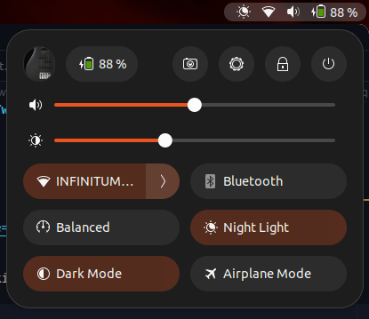
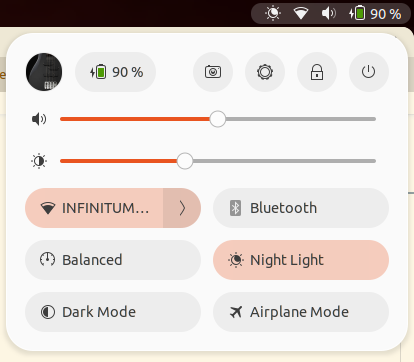
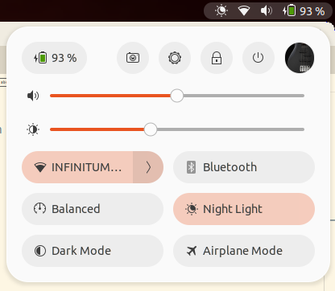

# Quick Settings Avatar 

Quick Settings Avatar is a Gnome 43+ extension that simply adds ypur user avatar in the Quick Settings panel, right in the system related settings.
Inspired by the early Gnome mocks for the quick settings panel:
https://gitlab.gnome.org/Teams/Design/os-mockups/-/blob/master/system-status/quick-settings/quick-toggles-2.png

 
 

## Features

You can choose the placement of the avatar to be either in the right side of the left one:
|Left side|Right side|
|--|--|
|||

## Notes
I have only tested it in laptop devices, mobile and desktop might present some visual issues, install it at your own risk.

## TODO

- [ ] Add support to make the Avatar thumbnail larger
- [ ] Add options to remove system settings toggles to better adapt it to the available space (possibly will be added in [quick-settings-tweaks](https://github.com/qwreey75/quick-settings-tweaks))

## License
This program is distributed under the terms of the GNU General Public License, version 3 or later.
